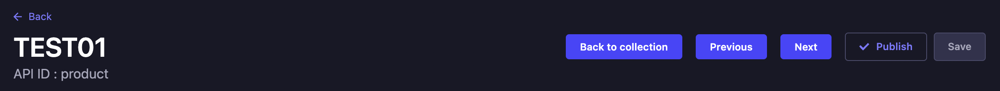

# Strapi Plugin Collection Navigation

A simple Strapi plugin to add previous and next button to navigate through a collection on the edit page without going back to the collection page.

## Caveat

Please note this plugin depends a lot on the pre-existing DOM structure of the Strapi admin panel, as there is currently no injection zone available for the specific area I want to place the navigation control (as of Strapi v4.3.6). So please use with caution!

## Table Of Content

- [Strapi Plugin Collection Navigation](#strapi-plugin-collection-navigation)
  - [Caveat](#caveat)
  - [Table Of Content](#table-of-content)
  - [Requirements](#requirements)
  - [Installation](#installation)
  - [Rebuild The Admin Panel](#rebuild-the-admin-panel)
- [Usage](#usage)
  - [Author](#author)

## Requirements

Strapi v4 is required.

## Installation

1. Download

```
yarn add strapi-plugin-collection-navigation
```

or

```
npm i strapi-plugin-collection-navigation
```

2. Enable the plugin

Add in the file `config/plugins.js`:

```js
module.exports = ({ env }) => ({
  //...
  'collection-navigation': {
    enabled: true,
  },
  //...
});
```

## Rebuild The Admin Panel

New releases can introduce changes to the administration panel that require a rebuild. Rebuild the admin panel with one of the following commands:

```
yarn build --clean
```

or

```
npm run build --clean
```

# Usage

Once the plugin is installed and setup, the functionalities are accessible on the content management page of items of a collection.

<p align="center">
  
</p>

## Author

Marc Tse - [@MarcieMarc425](https://github.com/MarcieMarc425)